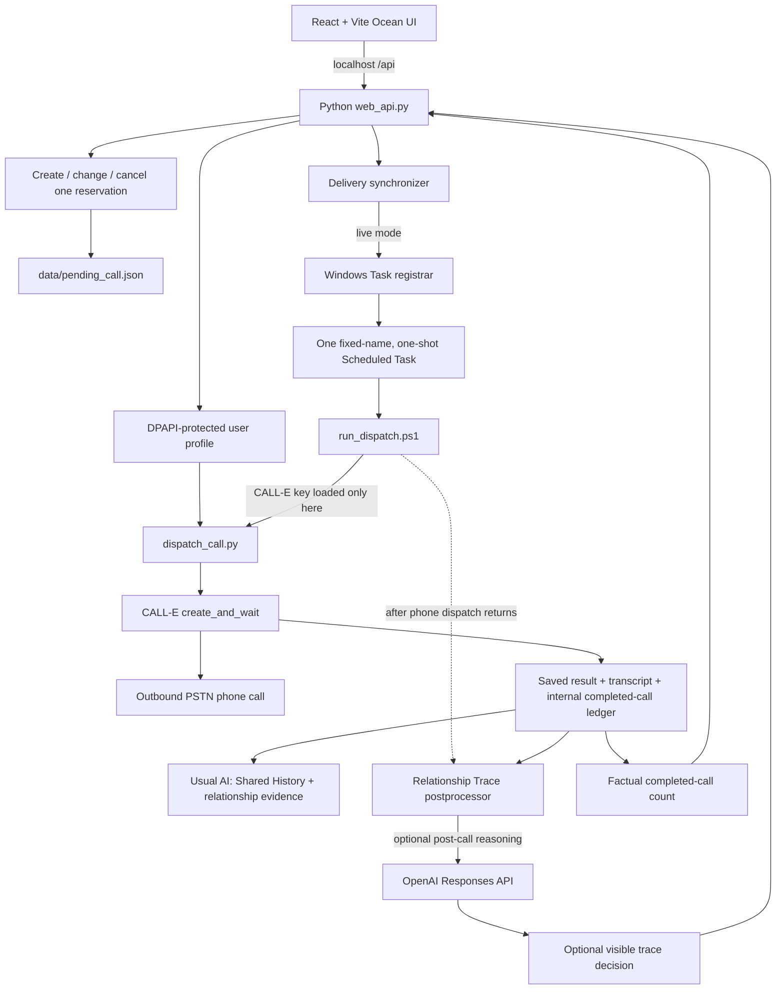

# Later, Me.

A quiet phone call from the person who cared about you a little earlier: yourself.

Powered by CALL-E.

## What is Later, Me.?

Later, Me. is an experimental hackathon prototype for reserving a phone call to
your later self. A small act of care from a few hours—or years—earlier returns as
an actual AI phone call.

It is not only a reminder app. The project asks:

> What should an AI consider before it calls a human?

The aim is a human-considerate phone experience: one that does not treat an
answered call as permission to prolong the conversation, push an agenda, or
optimize engagement at the person's expense.

## The experience

1. Choose a time between 4 hours and 10 years from now.
2. Optionally leave a small message for your later self.
3. Later, an actual CALL-E-powered phone call arrives at your registered number.
4. The AI converses with restraint and consideration. Silence, no particular
   topic, and a short call are all valid outcomes.
5. Some interactions may leave a small Relationship Trace; many leave nothing.

There can be only one pending call at a time. Calls are one-shot, not recurring,
and delivery or memory failure does not authorize an automatic retry.

## Human Consideration Model

Later, Me. uses four ideas as a design model for conversational judgment:

- **Sassuru (察する) — sensing context.** Notice silence, hesitation, brief
  answers, tiredness, refusal, or the possibility that one more gentle opening
  could help. An inference is never treated as a fact.
- **Kizukai (気遣い) — taking the first considerate step.** Consideration can
  mean speaking up, checking once, or offering a low-pressure opening—not only
  withdrawing.
- **Tsutsushimu (慎む) — restraint and self-check.** Limit insistence,
  assumptions, repeated confirmation, and the AI's own drive to achieve an
  outcome.
- **Omoiyari (思いやり) — an extra step when it may genuinely help.** When the
  context is sufficiently supported, the AI may make one slightly more direct
  suggestion for the person's benefit.

These are not a fixed state machine, score, or cultural claim. The AI may move
closer, check, step slightly further in, or pull back according to context.

**The goal is not compliance. The goal is whether the contact can make everyday
life slightly easier.**

## Why the four-hour minimum?

The four-hour minimum creates real temporal distance between the person who
scheduled the call and the person who receives it. Later, Me. is not designed as
an instant, repeatable interaction loop for maximizing usage, attachment, or
spending. It should feel like the earlier self quietly remembered the later one.

The maximum reservation horizon is 10 years.

## Relationship Trace

Later, Me. separates three kinds of information:

- **Internal system logs** support delivery, debugging, and safe failure
  handling. They are not a user-facing conversation history.
- **Factual call count** records only how many unique calls completed. It is not
  intimacy, a level, a streak, an unlock condition, or relationship evidence.
- **Optional Relationship Trace** is a short, user-visible fragment that may be
  left when a specific interaction seems genuinely worth carrying forward.

Relationship Trace does not appear after every call. After the CALL-E call has
finished and its result has been persisted, an independent post-call process can
ask OpenAI whether to leave one bounded trace. Leaving nothing is a complete and
normal result.

The persistent “usual AI” layer separately keeps concise Shared History and
evidence-backed relationship hypotheses for later calls. It does not use a
single relationship score, and it does not inject every previous transcript
into the next prompt. The project deliberately avoids synthetic or gamified
intimacy.

## Architecture



The browser never exposes an immediate-call endpoint. In live delivery mode,
booking synchronizes the one pending reservation with one fixed-name Windows
Scheduled Task. At the reserved time, the task invokes the guarded dispatcher.

## What CALL-E does

CALL-E is the outbound phone-call layer. The Python dispatcher builds the task,
calls the installed CALL-E SDK's `create_and_wait` method, waits for a terminal
result, retrieves transcript details when available, and persists the private
local result. Terminal failure metadata is separately allowlisted and redacted.
The scheduled delivery path uses the user's registered phone profile;
third-party calling is not supported.

## What OpenAI does

OpenAI is currently used for optional **post-call Relationship Trace reasoning**.
The OpenAI key is loaded only after the CALL-E phone process has returned. An
OpenAI failure cannot authorize another phone call, restore a cleared pending
reservation, or replace the authoritative CALL-E result.

The live conversation is handled by CALL-E in the current prototype. There is
no OpenAI Realtime voice integration.

## Privacy and local data

- API keys are operator-side secrets and are never requested by the web UI.
- The user's own phone number and language profile are stored locally in a
  Windows CurrentUser DPAPI-protected file. The public profile API reports only
  completion, language, and whether a phone is registered—not the number.
- CALL-E and optional OpenAI credentials use the repository's local Windows
  DPAPI scripts where configured.
- Reservations, phone numbers, transcripts, production results, logs,
  diagnostic output, usual-AI state, relationship traces, encrypted blobs,
  virtual environments, dependencies, and build output are excluded from Git.
- Automated tests use temporary or isolated storage and fake CALL-E clients.

DPAPI data is tied to the Windows user context that created it. Do not commit,
copy, or publish files under `data/`, `results/`, `logs/`, or diagnostic output
directories.

## Running locally

Hackathon judges and evaluators should start with
[JUDGE_QUICKSTART.md](JUDGE_QUICKSTART.md). It uses judge-owned credentials and
the existing localhost-only Windows delivery architecture.

### Prerequisites

- Windows 10 or 11 for the protected profile and live Task Scheduler path
- CPython 3.13
- Node.js and npm
- CALL-E credentials only if you intentionally configure outbound calling
- An OpenAI API key only if you intentionally enable post-call Relationship Trace

Create the Python environment from the repository root. Replace the Python path
placeholder with an installed CPython 3.13 executable; do not copy another
machine's `.venv`.

```powershell
$python313 = "C:\path\to\Python313\python.exe"
& $python313 -m venv .venv
& .\.venv\Scripts\python.exe -m pip install -r requirements-dev.txt
```

Install the frontend dependencies:

```powershell
Set-Location web
npm ci
Set-Location ..
```

### Safe isolated mode

This mode runs the real React booking flow against temporary local data. It
cannot dispatch a call and cannot use the repository's production data roots.

```powershell
$qaRoot = Join-Path ([System.IO.Path]::GetTempPath()) ("later-me-qa-" + [guid]::NewGuid())
New-Item -ItemType Directory -Path $qaRoot | Out-Null
$env:CALL_E_STORAGE_MODE = "isolated"
$env:CALL_E_DELIVERY_MODE = "disabled"
$env:CALL_E_DATA_ROOT = Join-Path $qaRoot "data"
$env:CALL_E_RESULTS_ROOT = Join-Path $qaRoot "results"
$env:CALL_E_INSTANCE_ID = "local-qa"
& .\.venv\Scripts\python.exe web_api.py
```

In a second PowerShell window:

```powershell
Set-Location web
$env:VITE_CALL_E_QA_INSTANCE_ID = "local-qa"
npm run dev
```

Open the localhost URL printed by Vite. The API binds to
`http://127.0.0.1:8787`; Vite proxies relative `/api` requests to it. The
canonical 4-hour minimum, 10-year maximum, and one-pending-call rule remain in
force.

### Live delivery

The live path is intentionally Windows- and operator-specific. It requires a
completed first-run profile, locally provisioned CALL-E credentials, real
storage, explicit `CALL_E_DELIVERY_MODE=live`, and permission to register the
one-shot Task Scheduler task. Optional OpenAI credentials are provisioned
separately for Relationship Trace. Review `save_secrets.ps1`,
`setup_openai_key.ps1`, `register_live_task.ps1`, and `run_dispatch.ps1` before
enabling live delivery.

No live-call command is part of this safe quickstart. Never use
`dispatch_call.py --execute-call` unless you are intentionally authorizing a
real call to your own registered number.

## Testing

Run the Python suite from the repository root:

```powershell
& .\.venv\Scripts\python.exe -m unittest discover -s tests -p "test_*.py" -v
```

Run frontend checks from `web/`:

```powershell
npm run lint
npm run build
```

The Python tests use `unittest`, temporary storage, and fake call clients. The
frontend checks use Oxlint, TypeScript, and Vite's production build.

## Prototype status

Later, Me. is a localhost-only, Windows-oriented experimental hackathon
prototype. A real scheduled CALL-E outbound phone call and local result
persistence have been validated end to end. It is not a production or
commercial service, a public deployment, or a fully autonomous relationship AI.

## Design principles

- Consideration over engagement
- Relationship without gamification
- Presence without pretending to be human
- Restraint without passivity
- Actual phone experience, not only simulation

## Built with

- [CALL-E](https://call-e.ai/) Python SDK (`calle-ai==0.2.0`)
- Python 3.13 and `httpx`
- React 19, TypeScript, and Vite 8
- OpenAI Responses API for optional post-call Relationship Trace reasoning
- Windows PowerShell, CurrentUser DPAPI, and Task Scheduler

## Creator

鮫洲ネオ

## License / Artwork

Later, Me. is source-available, not open source. Noncommercial rights in the
software are governed by the [PolyForm Noncommercial License 1.0.0](LICENSE).
Commercial use requires separate prior written permission and may be permitted
free of charge; see [COMMERCIAL_USE.md](COMMERCIAL_USE.md) for the project's
permission philosophy.

The Ocean artwork has separate terms described in
[ART_PROVENANCE.md](ART_PROVENANCE.md). Those documents are authoritative; this
README does not expand or replace their terms.

---

日本語メモ：Later, Me. は「少し先のあなたを、気にかけておく」ための、
CALL-Eを使った実験的な未来電話プロトタイプです。
